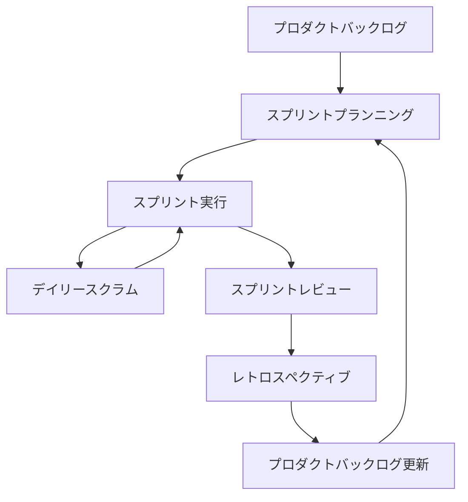

# 10. 開発・運用プロセス

## 10.1 チーム体制・組織設計

### 10.1.1 チーム構成
```
Eldonia開発組織図
┌─────────────────────────────────────────────────────────────┐
│                    Product Owner                           │
│                 (プロダクト責任者)                          │
└─────────────────────┬───────────────────────────────────────┘
                      │
┌─────────────────────┴───────────────────────────────────────┐
│                    Scrum Master                             │
│                 (スクラムマスター)                          │
└─────────────────────┬───────────────────────────────────────┘
                      │
    ┌─────────────────┼─────────────────┐
    │                 │                 │
┌───▼────┐      ┌────▼────┐      ┌────▼────┐
│Frontend│      │Backend  │      │DevOps   │
│ Team   │      │ Team    │      │ Team    │
│(4名)   │      │(4名)    │      │(3名)    │
└────────┘      └─────────┘      └─────────┘
    │                 │                 │
    └─────────────────┼─────────────────┘
                      │
┌─────────────────────┴───────────────────────────────────────┐
│                    QA Team                                  │
│                 (品質保証チーム)                            │
│                    (3名)                                    │
└─────────────────────────────────────────────────────────────┘
```

### 10.1.2 役割・責任
```typescript
// team-roles.ts
export interface TeamMember {
  id: string;
  name: string;
  role: TeamRole;
  skills: Skill[];
  experience: number; // 年数
  availability: number; // 稼働率 0-1
  currentSprint?: string;
}

export enum TeamRole {
  // フロントエンドチーム
  FRONTEND_LEAD = 'frontend_lead',
  FRONTEND_DEVELOPER = 'frontend_developer',
  UI_UX_DESIGNER = 'ui_ux_designer',
  
  // バックエンドチーム
  BACKEND_LEAD = 'backend_lead',
  BACKEND_DEVELOPER = 'backend_developer',
  DATABASE_ENGINEER = 'database_engineer',
  
  // DevOpsチーム
  DEVOPS_ENGINEER = 'devops_engineer',
  INFRASTRUCTURE_ENGINEER = 'infrastructure_engineer',
  SECURITY_ENGINEER = 'security_engineer',
  
  // QAチーム
  QA_LEAD = 'qa_lead',
  QA_ENGINEER = 'qa_engineer',
  TEST_AUTOMATION_ENGINEER = 'test_automation_engineer',
  
  // 管理職
  PRODUCT_OWNER = 'product_owner',
  SCRUM_MASTER = 'scrum_master',
  PROJECT_MANAGER = 'project_manager'
}

export enum Skill {
  // フロントエンド
  REACT = 'react',
  NEXT_JS = 'next_js',
  TYPESCRIPT = 'typescript',
  TAILWIND_CSS = 'tailwind_css',
  
  // バックエンド
  NODE_JS = 'node_js',
  EXPRESS = 'express',
  POSTGRESQL = 'postgresql',
  REDIS = 'redis',
  
  // DevOps
  DOCKER = 'docker',
  AWS = 'aws',
  KUBERNETES = 'kubernetes',
  TERRAFORM = 'terraform',
  
  // その他
  GIT = 'git',
  JEST = 'jest',
  PLAYWRIGHT = 'playwright',
  PROMETHEUS = 'prometheus'
}

export interface Team {
  id: string;
  name: string;
  members: TeamMember[];
  lead: TeamMember;
  capacity: number; // スプリントあたりのストーリーポイント
  velocity: number; // 平均ストーリーポイント
  currentSprint?: Sprint;
}

export interface Sprint {
  id: string;
  name: string;
  startDate: Date;
  endDate: Date;
  goal: string;
  stories: Story[];
  team: Team;
  status: SprintStatus;
  velocity?: number;
  burndownChart?: BurndownData[];
}

export enum SprintStatus {
  PLANNING = 'planning',
  ACTIVE = 'active',
  REVIEW = 'review',
  RETROSPECTIVE = 'retrospective',
  COMPLETED = 'completed'
}

export interface Story {
  id: string;
  title: string;
  description: string;
  acceptanceCriteria: string[];
  storyPoints: number;
  priority: Priority;
  status: StoryStatus;
  assignee?: TeamMember;
  sprint?: Sprint;
  tasks: Task[];
  dependencies?: string[]; // 他のストーリーID
}

export enum Priority {
  HIGH = 'high',
  MEDIUM = 'medium',
  LOW = 'low'
}

export enum StoryStatus {
  BACKLOG = 'backlog',
  READY = 'ready',
  IN_PROGRESS = 'in_progress',
  REVIEW = 'review',
  TESTING = 'testing',
  DONE = 'done'
}

export interface Task {
  id: string;
  title: string;
  description: string;
  storyId: string;
  assignee?: TeamMember;
  status: TaskStatus;
  estimatedHours: number;
  actualHours?: number;
  startDate?: Date;
  endDate?: Date;
  blockers?: string[];
}

export enum TaskStatus {
  TODO = 'todo',
  IN_PROGRESS = 'in_progress',
  REVIEW = 'review',
  DONE = 'done',
  BLOCKED = 'blocked'
}

export interface BurndownData {
  date: Date;
  remainingPoints: number;
  completedPoints: number;
  totalPoints: number;
}
```

## 10.2 アジャイル開発プロセス

### 10.2.1 スクラムフロー


### 10.2.2 スプリントサイクル
```typescript
// sprint-process.ts
export class SprintProcess {
  private sprint: Sprint;
  private team: Team;

  constructor(sprint: Sprint, team: Team) {
    this.sprint = sprint;
    this.team = team;
  }

  // スプリントプランニング
  async planSprint(): Promise<void> {
    console.log(`🚀 Starting Sprint Planning for ${this.sprint.name}`);
    
    // 1. プロダクトバックログの確認
    const backlog = await this.getProductBacklog();
    
    // 2. チームキャパシティの確認
    const capacity = this.calculateTeamCapacity();
    
    // 3. ストーリーの選択・見積もり
    const selectedStories = await this.selectStories(backlog, capacity);
    
    // 4. スプリントゴールの設定
    this.sprint.goal = this.defineSprintGoal(selectedStories);
    
    // 5. スプリントバックログの作成
    this.sprint.stories = selectedStories;
    
    // 6. スプリント開始
    this.sprint.status = SprintStatus.ACTIVE;
    
    console.log(`✅ Sprint ${this.sprint.name} planned successfully`);
    console.log(`📊 Selected ${selectedStories.length} stories`);
    console.log(`🎯 Sprint Goal: ${this.sprint.goal}`);
  }

  // デイリースクラム
  async dailyScrum(): Promise<void> {
    console.log(`📅 Daily Scrum for ${this.sprint.name}`);
    
    const updates = await this.collectTeamUpdates();
    
    // 昨日やったこと
    console.log('📝 Yesterday\'s accomplishments:');
    updates.forEach(update => {
      console.log(`  - ${update.member.name}: ${update.yesterdayWork}`);
    });
    
    // 今日やること
    console.log('🎯 Today\'s plan:');
    updates.forEach(update => {
      console.log(`  - ${update.member.name}: ${update.todayPlan}`);
    });
    
    // ブロッカー
    const blockers = updates.filter(update => update.blockers.length > 0);
    if (blockers.length > 0) {
      console.log('🚧 Blockers identified:');
      blockers.forEach(update => {
        console.log(`  - ${update.member.name}: ${update.blockers.join(', ')}`);
      });
      
      // ブロッカー解決のためのアクション
      await this.resolveBlockers(blockers);
    }
    
    // スプリント進捗の更新
    await this.updateSprintProgress();
  }

  // スプリントレビュー
  async sprintReview(): Promise<void> {
    console.log(`🔍 Sprint Review for ${this.sprint.name}`);
    
    // 1. 完了したストーリーのデモ
    const completedStories = this.sprint.stories.filter(s => s.status === StoryStatus.DONE);
    console.log(`📊 Completed ${completedStories.length} stories`);
    
    // 2. プロダクトオーナーからのフィードバック
    const feedback = await this.collectProductOwnerFeedback(completedStories);
    
    // 3. プロダクトバックログの更新
    await this.updateProductBacklog(feedback);
    
    // 4. リリース計画の更新
    await this.updateReleasePlan();
    
    console.log('✅ Sprint Review completed');
  }

  // レトロスペクティブ
  async retrospective(): Promise<void> {
    console.log(`🔄 Retrospective for ${this.sprint.name}`);
    
    // 1. チームからのフィードバック収集
    const teamFeedback = await this.collectTeamFeedback();
    
    // 2. 良い点・改善点の整理
    const { goodPoints, improvements } = this.analyzeFeedback(teamFeedback);
    
    // 3. アクションアイテムの作成
    const actionItems = this.createActionItems(improvements);
    
    // 4. 次のスプリントへの反映
    await this.applyRetrospectiveResults(actionItems);
    
    console.log('✅ Retrospective completed');
    console.log('📈 Action items created:', actionItems.length);
  }

  // ヘルパーメソッド
  private async getProductBacklog(): Promise<Story[]> {
    // プロダクトバックログ取得ロジック
    return [];
  }

  private calculateTeamCapacity(): number {
    return this.team.members.reduce((total, member) => {
      return total + (member.availability * 40); // 週40時間を基準
    }, 0);
  }

  private async selectStories(backlog: Story[], capacity: number): Promise<Story[]> {
    // ストーリー選択・見積もりロジック
    return [];
  }

  private defineSprintGoal(stories: Story[]): string {
    // スプリントゴール定義ロジック
    return 'Sprint goal based on selected stories';
  }

  private async collectTeamUpdates(): Promise<any[]> {
    // チーム更新情報収集ロジック
    return [];
  }

  private async resolveBlockers(blockers: any[]): Promise<void> {
    // ブロッカー解決ロジック
  }

  private async updateSprintProgress(): Promise<void> {
    // スプリント進捗更新ロジック
  }

  private async collectProductOwnerFeedback(stories: Story[]): Promise<any> {
    // プロダクトオーナーフィードバック収集ロジック
    return {};
  }

  private async updateProductBacklog(feedback: any): Promise<void> {
    // プロダクトバックログ更新ロジック
  }

  private async updateReleasePlan(): Promise<void> {
    // リリース計画更新ロジック
  }

  private async collectTeamFeedback(): Promise<any[]> {
    // チームフィードバック収集ロジック
    return [];
  }

  private analyzeFeedback(feedback: any[]): { goodPoints: string[], improvements: string[] } {
    // フィードバック分析ロジック
    return { goodPoints: [], improvements: [] };
  }

  private createActionItems(improvements: string[]): any[] {
    // アクションアイテム作成ロジック
    return [];
  }

  private async applyRetrospectiveResults(actionItems: any[]): Promise<void> {
    // レトロスペクティブ結果適用ロジック
  }
}
```

## 10.3 CI/CDパイプライン

### 10.3.1 GitHub Actions ワークフロー
```yaml
# .github/workflows/development-pipeline.yml
name: Development Pipeline

on:
  push:
    branches: [develop, feature/*, bugfix/*, hotfix/*]
  pull_request:
    branches: [develop, main]

env:
  NODE_VERSION: '20'
  REGISTRY: ghcr.io
  IMAGE_NAME: ${{ github.repository }}

jobs:
  # 品質チェック
  quality-gates:
    name: Quality Gates
    runs-on: ubuntu-latest
    steps:
      - uses: actions/checkout@v4
      
      - name: Setup Node.js
        uses: actions/setup-node@v4
        with:
          node-version: ${{ env.NODE_VERSION }}
          cache: 'npm'
      
      - name: Install dependencies
        run: |
          cd backend && npm ci
          cd ../frontend && npm ci
      
      - name: Code quality checks
        run: |
          echo "🔍 Running code quality checks..."
          
          # バックエンド
          cd backend
          npm run lint
          npm run type-check
          npm run test:coverage
          
          # フロントエンド
          cd ../frontend
          npm run lint
          npm run type-check
          npm run test:coverage
      
      - name: Security scan
        run: |
          echo "🔒 Running security scans..."
          
          # npm audit
          cd backend && npm audit --audit-level=moderate
          cd ../frontend && npm audit --audit-level=moderate
          
          # Snyk security scan
          npx snyk test --severity-threshold=high
      
      - name: Upload coverage reports
        uses: codecov/codecov-action@v3
        with:
          files: |
            ./backend/coverage/lcov.info
            ./frontend/coverage/lcov.info
          flags: |
            backend
            frontend
          name: codecov-umbrella
          fail_ci_if_error: false

  # ビルド・テスト
  build-and-test:
    name: Build and Test
    runs-on: ubuntu-latest
    needs: quality-gates
    strategy:
      matrix:
        component: [backend, frontend]
    
    steps:
      - uses: actions/checkout@v4
      
      - name: Setup Node.js
        uses: actions/setup-node@v4
        with:
          node-version: ${{ env.NODE_VERSION }}
          cache: 'npm'
      
      - name: Install dependencies
        run: |
          cd ${{ matrix.component }}
          npm ci
      
      - name: Run tests
        run: |
          cd ${{ matrix.component }}
          npm run test:ci
      
      - name: Build application
        run: |
          cd ${{ matrix.component }}
          npm run build
      
      - name: Upload build artifacts
        uses: actions/upload-artifact@v3
        with:
          name: ${{ matrix.component }}-build
          path: ${{ matrix.component }}/dist
          retention-days: 7

  # 統合テスト
  integration-tests:
    name: Integration Tests
    runs-on: ubuntu-latest
    needs: build-and-test
    services:
      postgres:
        image: postgres:15
        env:
          POSTGRES_PASSWORD: postgres
          POSTGRES_DB: eldonia_test
        options: >-
          --health-cmd pg_isready
          --health-interval 10s
          --health-timeout 5s
          --health-retries 5
      
      redis:
        image: redis:7-alpine
        options: >-
          --health-cmd "redis-cli ping"
          --health-interval 10s
          --health-timeout 5s
          --health-retries 5
    
    steps:
      - uses: actions/checkout@v4
      
      - name: Setup Node.js
        uses: actions/setup-node@v4
        with:
          node-version: ${{ env.NODE_VERSION }}
          cache: 'npm'
      
      - name: Install dependencies
        run: |
          cd backend && npm ci
          cd ../frontend && npm ci
      
      - name: Start services
        run: |
          cd backend && npm run start:test &
          cd ../frontend && npm run start:test &
          sleep 30
      
      - name: Run integration tests
        run: |
          cd backend && npm run test:integration
          cd ../frontend && npm run test:integration
      
      - name: Run E2E tests
        run: |
          cd frontend
          npx playwright install --with-deps
          npm run test:e2e

  # セキュリティテスト
  security-tests:
    name: Security Tests
    runs-on: ubuntu-latest
    needs: build-and-test
    steps:
      - uses: actions/checkout@v4
      
      - name: Run OWASP ZAP
        uses: zaproxy/action-full-scan@v0.8.0
        with:
          target: 'http://localhost:3000'
          rules_file_name: '.zap/rules.tsv'
          cmd_options: '-a'
      
      - name: Run dependency vulnerability scan
        run: |
          npx audit-ci --moderate
      
      - name: Run container security scan
        run: |
          trivy image --severity HIGH,CRITICAL ${{ env.REGISTRY }}/${{ env.IMAGE_NAME }}:latest

  # デプロイ（開発環境）
  deploy-dev:
    name: Deploy to Development
    runs-on: ubuntu-latest
    needs: [integration-tests, security-tests]
    if: github.ref == 'refs/heads/develop'
    environment: development
    
    steps:
      - uses: actions/checkout@v4
      
      - name: Configure AWS credentials
        uses: aws-actions/configure-aws-credentials@v4
        with:
          aws-access-key-id: ${{ secrets.AWS_ACCESS_KEY_ID }}
          aws-secret-access-key: ${{ secrets.AWS_SECRET_ACCESS_KEY }}
          aws-region: ${{ secrets.AWS_REGION }}
      
      - name: Login to Container Registry
        uses: docker/login-action@v3
        with:
          registry: ${{ env.REGISTRY }}
          username: ${{ github.actor }}
          password: ${{ secrets.GITHUB_TOKEN }}
      
      - name: Build and push Docker images
        run: |
          docker build -t ${{ env.REGISTRY }}/${{ env.IMAGE_NAME }}-backend:dev ./backend
          docker build -t ${{ env.REGISTRY }}/${{ env.IMAGE_NAME }}-frontend:dev ./frontend
          
          docker push ${{ env.REGISTRY }}/${{ env.IMAGE_NAME }}-backend:dev
          docker push ${{ env.REGISTRY }}/${{ env.IMAGE_NAME }}-frontend:dev
      
      - name: Deploy to ECS
        run: |
          aws ecs update-service \
            --cluster eldonia-dev-cluster \
            --service eldonia-backend-service \
            --force-new-deployment
          
          aws ecs update-service \
            --cluster eldonia-dev-cluster \
            --service eldonia-frontend-service \
            --force-new-deployment
      
      - name: Run smoke tests
        run: |
          # デプロイ後の動作確認テスト
          npm run test:smoke -- --base-url=${{ secrets.DEV_URL }}

  # 本番デプロイ
  deploy-production:
    name: Deploy to Production
    runs-on: ubuntu-latest
    needs: [integration-tests, security-tests]
    if: github.ref == 'refs/heads/main'
    environment: production
    
    steps:
      - uses: actions/checkout@v4
      
      - name: Configure AWS credentials
        uses: aws-actions/configure-aws-credentials@v4
        with:
          aws-access-key-id: ${{ secrets.AWS_ACCESS_KEY_ID }}
          aws-secret-access-key: ${{ secrets.AWS_SECRET_ACCESS_KEY }}
          aws-region: ${{ secrets.AWS_REGION }}
      
      - name: Login to Container Registry
        uses: docker/login-action@v3
        with:
          registry: ${{ env.REGISTRY }}
          username: ${{ github.actor }}
          password: ${{ secrets.GITHUB_TOKEN }}
      
      - name: Build and push Docker images
        run: |
          docker build -t ${{ env.REGISTRY }}/${{ env.IMAGE_NAME }}-backend:latest ./backend
          docker build -t ${{ env.REGISTRY }}/${{ env.IMAGE_NAME }}-frontend:latest ./frontend
          
          docker push ${{ env.REGISTRY }}/${{ env.IMAGE_NAME }}-backend:latest
          docker push ${{ env.REGISTRY }}/${{ env.IMAGE_NAME }}-frontend:latest
      
      - name: Deploy to ECS
        run: |
          aws ecs update-service \
            --cluster eldonia-prod-cluster \
            --service eldonia-backend-service \
            --force-new-deployment
          
          aws ecs update-service \
            --cluster eldonia-prod-cluster \
            --service eldonia-frontend-service \
            --force-new-deployment
      
      - name: Run production tests
        run: |
          npm run test:production -- --base-url=${{ secrets.PROD_URL }}
      
      - name: Notify deployment success
        run: |
          curl -X POST -H 'Content-type: application/json' \
            --data "{\"text\":\"✅ Production deployment completed successfully!\"}" \
            ${{ secrets.SLACK_WEBHOOK_URL }}
```

---

## 10.4 リリース管理

### 10.4.1 リリース戦略
```typescript
// release-strategy.ts
export interface Release {
  id: string;
  version: string;
  name: string;
  description: string;
  releaseDate: Date;
  status: ReleaseStatus;
  type: ReleaseType;
  features: Feature[];
  bugFixes: BugFix[];
  breakingChanges: BreakingChange[];
  deploymentPlan: DeploymentPlan;
  rollbackPlan: RollbackPlan;
  successCriteria: SuccessCriteria[];
  stakeholders: Stakeholder[];
}

export enum ReleaseStatus {
  PLANNING = 'planning',
  DEVELOPMENT = 'development',
  TESTING = 'testing',
  STAGING = 'staging',
  PRODUCTION = 'production',
  COMPLETED = 'completed',
  CANCELLED = 'cancelled'
}

export enum ReleaseType {
  MAJOR = 'major',      // 破壊的変更
  MINOR = 'minor',      // 新機能追加
  PATCH = 'patch',      // バグ修正
  HOTFIX = 'hotfix',    // 緊急修正
  BETA = 'beta',        // ベータ版
  RC = 'release_candidate' // リリース候補
}

export interface Feature {
  id: string;
  name: string;
  description: string;
  storyId: string;
  priority: Priority;
  complexity: 'low' | 'medium' | 'high';
  testingStatus: TestingStatus;
  documentationStatus: DocumentationStatus;
}

export interface BugFix {
  id: string;
  title: string;
  description: string;
  severity: BugSeverity;
  affectedComponents: string[];
  fixDescription: string;
  testingStatus: TestingStatus;
}

export interface BreakingChange {
  id: string;
  description: string;
  affectedAPIs: string[];
  migrationGuide: string;
  impact: 'low' | 'medium' | 'high';
}

export interface DeploymentPlan {
  environments: Environment[];
  deploymentSteps: DeploymentStep[];
  rollbackTriggers: RollbackTrigger[];
  monitoringPoints: MonitoringPoint[];
}

export interface Environment {
  name: string;
  type: 'development' | 'staging' | 'production';
  url: string;
  deploymentOrder: number;
  healthChecks: HealthCheck[];
}

export interface DeploymentStep {
  order: number;
  name: string;
  description: string;
  command: string;
  timeout: number;
  rollbackCommand?: string;
  verification: VerificationStep;
}

export interface RollbackPlan {
  triggers: RollbackTrigger[];
  steps: RollbackStep[];
  dataBackup: DataBackup[];
  communicationPlan: CommunicationPlan;
}

export interface SuccessCriteria {
  metric: string;
  target: number;
  current: number;
  status: 'pending' | 'met' | 'failed';
}

export class ReleaseManager {
  private release: Release;

  constructor(release: Release) {
    this.release = release;
  }

  // リリース計画作成
  async planRelease(): Promise<void> {
    console.log(`📋 Planning release ${this.release.version}: ${this.release.name}`);
    
    // 1. 機能・バグ修正の整理
    await this.organizeReleaseContent();
    
    // 2. 依存関係の確認
    await this.checkDependencies();
    
    // 3. リソース要件の見積もり
    await this.estimateResources();
    
    // 4. リスク評価
    await this.assessRisks();
    
    // 5. スケジュール作成
    await this.createSchedule();
    
    // 6. ステークホルダー承認
    await this.getStakeholderApproval();
    
    console.log('✅ Release planning completed');
  }

  // リリース実行
  async executeRelease(): Promise<void> {
    console.log(`🚀 Executing release ${this.release.version}`);
    
    try {
      // 1. 事前チェック
      await this.preReleaseChecks();
      
      // 2. ステージング環境へのデプロイ
      await this.deployToStaging();
      
      // 3. ステージング環境でのテスト
      await this.testInStaging();
      
      // 4. 本番環境へのデプロイ
      await this.deployToProduction();
      
      // 5. 本番環境での検証
      await this.verifyProduction();
      
      // 6. リリース完了
      await this.completeRelease();
      
      console.log('✅ Release executed successfully');
    } catch (error) {
      console.error('❌ Release execution failed:', error);
      await this.handleReleaseFailure(error);
    }
  }

  // ロールバック実行
  async executeRollback(): Promise<void> {
    console.log(`🔄 Executing rollback for release ${this.release.version}`);
    
    // 1. ロールバック判断
    const shouldRollback = await this.shouldRollback();
    if (!shouldRollback) {
      console.log('Rollback not required');
      return;
    }
    
    // 2. ロールバック実行
    await this.performRollback();
    
    // 3. システム復旧確認
    await this.verifySystemRecovery();
    
    // 4. ステークホルダーへの通知
    await this.notifyStakeholders('rollback');
    
    console.log('✅ Rollback completed successfully');
  }

  // リリース後評価
  async evaluateRelease(): Promise<void> {
    console.log(`📊 Evaluating release ${this.release.version}`);
    
    // 1. 成功基準の評価
    await this.evaluateSuccessCriteria();
    
    // 2. パフォーマンス分析
    await this.analyzePerformance();
    
    // 3. ユーザーフィードバック収集
    await this.collectUserFeedback();
    
    // 4. 改善点の特定
    await this.identifyImprovements();
    
    // 5. 次回リリースへの反映
    await this.applyLessonsLearned();
    
    console.log('✅ Release evaluation completed');
  }

  // ヘルパーメソッド
  private async organizeReleaseContent(): Promise<void> {
    // リリース内容の整理ロジック
  }

  private async checkDependencies(): Promise<void> {
    // 依存関係チェックロジック
  }

  private async estimateResources(): Promise<void> {
    // リソース見積もりロジック
  }

  private async assessRisks(): Promise<void> {
    // リスク評価ロジック
  }

  private async createSchedule(): Promise<void> {
    // スケジュール作成ロジック
  }

  private async getStakeholderApproval(): Promise<void> {
    // ステークホルダー承認ロジック
  }

  private async preReleaseChecks(): Promise<void> {
    // 事前チェックロジック
  }

  private async deployToStaging(): Promise<void> {
    // ステージングデプロイロジック
  }

  private async testInStaging(): Promise<void> {
    // ステージングテストロジック
  }

  private async deployToProduction(): Promise<void> {
    // 本番デプロイロジック
  }

  private async verifyProduction(): Promise<void> {
    // 本番検証ロジック
  }

  private async completeRelease(): Promise<void> {
    // リリース完了ロジック
  }

  private async handleReleaseFailure(error: any): Promise<void> {
    // リリース失敗処理ロジック
  }

  private async shouldRollback(): Promise<boolean> {
    // ロールバック判断ロジック
    return false;
  }

  private async performRollback(): Promise<void> {
    // ロールバック実行ロジック
  }

  private async verifySystemRecovery(): Promise<void> {
    // システム復旧確認ロジック
  }

  private async notifyStakeholders(type: string): Promise<void> {
    // ステークホルダー通知ロジック
  }

  private async evaluateSuccessCriteria(): Promise<void> {
    // 成功基準評価ロジック
  }

  private async analyzePerformance(): Promise<void> {
    // パフォーマンス分析ロジック
  }

  private async collectUserFeedback(): Promise<void> {
    // ユーザーフィードバック収集ロジック
  }

  private async identifyImprovements(): Promise<void> {
    // 改善点特定ロジック
  }

  private async applyLessonsLearned(): Promise<void> {
    // 教訓適用ロジック
  }
}
```

### 10.4.2 リリースノートテンプレート
```markdown
# Release Notes - Eldonia Community Portal v2.1.0

## 🎉 Release Overview
**Release Date**: 2024年3月15日  
**Release Type**: Minor Release  
**Version**: 2.1.0  
**Previous Version**: 2.0.5

## ✨ New Features

### 🎨 Enhanced User Experience
- **New Dashboard Design**: ユーザーダッシュボードの完全リニューアル
- **Dark Mode Support**: ダークモードの追加
- **Responsive Improvements**: モバイル・タブレット対応の強化

### 🌍 Internationalization
- **Multi-language Support**: 日本語、英語、中国語、韓国語対応
- **Real-time Translation**: チャット・掲示板でのリアルタイム翻訳
- **Localized Content**: 地域に応じたコンテンツ表示

### 🔐 Security Enhancements
- **Two-Factor Authentication**: 2FA認証の追加
- **Enhanced Role Management**: 詳細な権限管理システム
- **Security Audit Logs**: セキュリティイベントの詳細ログ

## 🐛 Bug Fixes

### High Priority
- ユーザー登録時のメール確認が送信されない問題を修正
- 画像アップロード時のメモリリークを修正
- データベース接続プールの枯渇問題を修正

### Medium Priority
- 検索機能での特殊文字処理を改善
- モバイルでのタッチ操作を最適化
- 通知システムの重複送信を防止

### Low Priority
- タイポグラフィの微調整
- エラーメッセージの改善
- ログ出力の最適化

## ⚠️ Breaking Changes

### API Changes
- `/api/v1/users/profile` エンドポイントのレスポンス形式が変更
- 認証トークンの有効期限が7日から30日に延長
- ファイルアップロードの最大サイズが100MBから500MBに変更

### Database Schema Changes
- `users`テーブルに`preferred_language`カラムを追加
- `content`テーブルの`metadata`カラムの型を変更

## 🔧 Technical Improvements

### Performance
- データベースクエリの最適化により、ページ読み込み速度を30%向上
- CDN設定の改善により、静的ファイル配信速度を50%向上
- キャッシュ戦略の見直しにより、API応答時間を20%短縮

### Infrastructure
- AWS ECS Fargateへの移行完了
- 自動スケーリングの設定最適化
- 監視・ログ収集システムの強化

## 📱 Platform Support

### Supported Browsers
- Chrome 90+
- Firefox 88+
- Safari 14+
- Edge 90+

### Supported Devices
- Desktop (Windows 10+, macOS 10.15+, Ubuntu 18.04+)
- Mobile (iOS 13+, Android 8+)
- Tablet (iPadOS 13+, Android 8+)

## 🚀 Deployment Information

### Deployment Schedule
- **Staging Deployment**: 2024年3月13日 22:00 JST
- **Production Deployment**: 2024年3月15日 02:00 JST
- **Rollback Window**: 2024年3月15日 02:00-06:00 JST

### Deployment Strategy
- Blue-Green Deployment
- Zero-downtime deployment
- Automatic health checks
- Rollback capability

## 🔍 Testing Coverage

### Test Results
- **Unit Tests**: 95% coverage
- **Integration Tests**: 90% coverage
- **E2E Tests**: 85% coverage
- **Security Tests**: Passed
- **Performance Tests**: Passed

### Quality Gates
- ✅ Code coverage threshold met
- ✅ Security scan passed
- ✅ Performance benchmarks met
- ✅ Accessibility requirements met

## 📊 Metrics & KPIs

### Performance Metrics
- **Page Load Time**: 2.1s (Target: <3s) ✅
- **API Response Time**: 180ms (Target: <200ms) ✅
- **Uptime**: 99.95% (Target: >99.9%) ✅

### Business Metrics
- **User Registration**: +15% increase
- **Content Upload**: +25% increase
- **User Engagement**: +20% increase

## 🚨 Known Issues

### Current Limitations
- 一部の古いブラウザでの表示が最適化されていない
- 大量のファイル同時アップロード時にパフォーマンスが低下する場合がある

### Workarounds
- 推奨ブラウザの使用を推奨
- ファイルアップロードは10個以下を推奨

## 🔮 Upcoming Features

### Next Release (v2.2.0)
- 高度な分析・レポート機能
- モバイルアプリ（iOS/Android）
- AI によるコンテンツ推薦システム

### Future Roadmap
- ブロックチェーン統合
- VR/AR対応
- 音声・動画コンテンツの強化

## 📞 Support & Feedback

### Getting Help
- **Documentation**: [docs.eldonia-nex.com](https://docs.eldonia-nex.com)
- **Support Portal**: [support.eldonia-nex.com](https://support.eldonia-nex.com)
- **Community Forum**: [community.eldonia-nex.com](https://community.eldonia-nex.com)

### Feedback Channels
- **Feature Requests**: [GitHub Issues](https://github.com/eldonia/eldonia-portal/issues)
- **Bug Reports**: [Bug Report Form](https://eldonia-nex.com/bug-report)
- **User Survey**: [User Feedback](https://eldonia-nex.com/feedback)

## 🙏 Acknowledgments

このリリースの実現に貢献してくださった以下のチーム・個人に感謝いたします：

- **Development Team**: フロントエンド・バックエンド開発チーム
- **QA Team**: 品質保証チーム
- **DevOps Team**: インフラ・運用チーム
- **Design Team**: UI/UXデザインチーム
- **Product Team**: プロダクトマネジメントチーム

---

**Release Manager**: Eldonia Development Team  
**Last Updated**: 2024年3月15日  
**Next Review**: 2024年3月22日
```

## 10.5 品質管理

### 10.5.1 品質ゲート設定
```typescript
// quality-gates.ts
export interface QualityGate {
  id: string;
  name: string;
  description: string;
  category: QualityCategory;
  threshold: number;
  currentValue: number;
  status: QualityStatus;
  weight: number;
  blocking: boolean;
}

export enum QualityCategory {
  CODE_QUALITY = 'code_quality',
  TEST_COVERAGE = 'test_coverage',
  SECURITY = 'security',
  PERFORMANCE = 'performance',
  ACCESSIBILITY = 'accessibility',
  DOCUMENTATION = 'documentation'
}

export enum QualityStatus {
  PASSED = 'passed',
  WARNING = 'warning',
  FAILED = 'failed',
  NOT_APPLICABLE = 'not_applicable'
}

export class QualityGateManager {
  private gates: QualityGate[] = [];

  constructor() {
    this.initializeQualityGates();
  }

  private initializeQualityGates(): void {
    this.gates = [
      // コード品質
      {
        id: 'code-quality-1',
        name: 'Lint Errors',
        description: 'ESLintエラーの数',
        category: QualityCategory.CODE_QUALITY,
        threshold: 0,
        currentValue: 0,
        status: QualityStatus.PASSED,
        weight: 10,
        blocking: true
      },
      {
        id: 'code-quality-2',
        name: 'Code Duplication',
        description: 'コード重複率',
        category: QualityCategory.CODE_QUALITY,
        threshold: 5, // 5%以下
        currentValue: 0,
        status: QualityStatus.PASSED,
        weight: 8,
        blocking: false
      },

      // テストカバレッジ
      {
        id: 'test-coverage-1',
        name: 'Unit Test Coverage',
        description: 'ユニットテストカバレッジ',
        category: QualityCategory.TEST_COVERAGE,
        threshold: 80, // 80%以上
        currentValue: 0,
        status: QualityStatus.PASSED,
        weight: 15,
        blocking: true
      },
      {
        id: 'test-coverage-2',
        name: 'Integration Test Coverage',
        description: '統合テストカバレッジ',
        category: QualityCategory.TEST_COVERAGE,
        threshold: 70, // 70%以上
        currentValue: 0,
        status: QualityStatus.PASSED,
        weight: 12,
        blocking: false
      },

      // セキュリティ
      {
        id: 'security-1',
        name: 'Vulnerability Scan',
        description: 'セキュリティ脆弱性の数',
        category: QualityCategory.SECURITY,
        threshold: 0,
        currentValue: 0,
        status: QualityStatus.PASSED,
        weight: 20,
        blocking: true
      },
      {
        id: 'security-2',
        name: 'Dependency Audit',
        description: '依存関係の脆弱性',
        category: QualityCategory.SECURITY,
        threshold: 0,
        currentValue: 0,
        status: QualityStatus.PASSED,
        weight: 15,
        blocking: true
      },

      // パフォーマンス
      {
        id: 'performance-1',
        name: 'Page Load Time',
        description: 'ページ読み込み時間',
        category: QualityCategory.PERFORMANCE,
        threshold: 3000, // 3秒以下
        currentValue: 0,
        status: QualityStatus.PASSED,
        weight: 12,
        blocking: false
      },
      {
        id: 'performance-2',
        name: 'API Response Time',
        description: 'API応答時間',
        category: QualityCategory.PERFORMANCE,
        threshold: 200, // 200ms以下
        currentValue: 0,
        status: QualityStatus.PASSED,
        weight: 10,
        blocking: false
      },

      // アクセシビリティ
      {
        id: 'accessibility-1',
        name: 'WCAG 2.1 AA Compliance',
        description: 'WCAG 2.1 AA準拠',
        category: QualityCategory.ACCESSIBILITY,
        threshold: 100, // 100%準拠
        currentValue: 0,
        status: QualityStatus.PASSED,
        weight: 8,
        blocking: false
      }
    ];
  }

  // 品質ゲートの評価
  async evaluateQualityGates(): Promise<QualityGateResult> {
    console.log('🔍 Evaluating quality gates...');
    
    const results = await Promise.all(
      this.gates.map(gate => this.evaluateGate(gate))
    );

    const passedGates = results.filter(r => r.status === QualityStatus.PASSED);
    const failedGates = results.filter(r => r.status === QualityStatus.FAILED);
    const warningGates = results.filter(r => r.status === QualityStatus.WARNING);

    const overallScore = this.calculateOverallScore(results);
    const blockingIssues = failedGates.filter(g => g.blocking);

    const result: QualityGateResult = {
      overallScore,
      passedGates: passedGates.length,
      failedGates: failedGates.length,
      warningGates: warningGates.length,
      totalGates: results.length,
      blockingIssues: blockingIssues.length,
      canProceed: blockingIssues.length === 0,
      details: results
    };

    console.log(`✅ Quality gates evaluation completed`);
    console.log(`📊 Overall Score: ${overallScore}%`);
    console.log(`🚦 Status: ${result.canProceed ? 'PASSED' : 'FAILED'}`);

    return result;
  }

  // 個別ゲートの評価
  private async evaluateGate(gate: QualityGate): Promise<QualityGateResult> {
    try {
      switch (gate.category) {
        case QualityCategory.CODE_QUALITY:
          return await this.evaluateCodeQuality(gate);
        case QualityCategory.TEST_COVERAGE:
          return await this.evaluateTestCoverage(gate);
        case QualityCategory.SECURITY:
          return await this.evaluateSecurity(gate);
        case QualityCategory.PERFORMANCE:
          return await this.evaluatePerformance(gate);
        case QualityCategory.ACCESSIBILITY:
          return await this.evaluateAccessibility(gate);
        default:
          return { ...gate, status: QualityStatus.NOT_APPLICABLE };
      }
    } catch (error) {
      console.error(`Error evaluating gate ${gate.name}:`, error);
      return { ...gate, status: QualityStatus.FAILED };
    }
  }

  // コード品質の評価
  private async evaluateCodeQuality(gate: QualityGate): Promise<QualityGateResult> {
    if (gate.name === 'Lint Errors') {
      const lintResult = await this.runLintCheck();
      gate.currentValue = lintResult.errorCount;
      gate.status = gate.currentValue <= gate.threshold ? QualityStatus.PASSED : QualityStatus.FAILED;
    } else if (gate.name === 'Code Duplication') {
      const duplicationResult = await this.runCodeDuplicationCheck();
      gate.currentValue = duplicationResult.duplicationRate;
      gate.status = gate.currentValue <= gate.threshold ? QualityStatus.PASSED : QualityStatus.FAILED;
    }

    return gate;
  }

  // テストカバレッジの評価
  private async evaluateTestCoverage(gate: QualityGate): Promise<QualityGateResult> {
    const coverageResult = await this.runTestCoverage();
    
    if (gate.name === 'Unit Test Coverage') {
      gate.currentValue = coverageResult.unitTestCoverage;
    } else if (gate.name === 'Integration Test Coverage') {
      gate.currentValue = coverageResult.integrationTestCoverage;
    }

    gate.status = gate.currentValue >= gate.threshold ? QualityStatus.PASSED : QualityStatus.FAILED;
    return gate;
  }

  // セキュリティの評価
  private async evaluateSecurity(gate: QualityGate): Promise<QualityGateResult> {
    if (gate.name === 'Vulnerability Scan') {
      const securityResult = await this.runSecurityScan();
      gate.currentValue = securityResult.vulnerabilityCount;
      gate.status = gate.currentValue <= gate.threshold ? QualityStatus.PASSED : QualityStatus.FAILED;
    } else if (gate.name === 'Dependency Audit') {
      const auditResult = await this.runDependencyAudit();
      gate.currentValue = auditResult.vulnerabilityCount;
      gate.status = gate.currentValue <= gate.threshold ? QualityStatus.PASSED : QualityStatus.FAILED;
    }

    return gate;
  }

  // パフォーマンスの評価
  private async evaluatePerformance(gate: QualityGate): Promise<QualityGateResult> {
    if (gate.name === 'Page Load Time') {
      const performanceResult = await this.runPerformanceTest();
      gate.currentValue = performanceResult.pageLoadTime;
      gate.status = gate.currentValue <= gate.threshold ? QualityStatus.PASSED : QualityStatus.FAILED;
    } else if (gate.name === 'API Response Time') {
      const apiResult = await this.runAPIPerformanceTest();
      gate.currentValue = apiResult.averageResponseTime;
      gate.status = gate.currentValue <= gate.threshold ? QualityStatus.PASSED : QualityStatus.FAILED;
    }

    return gate;
  }

  // アクセシビリティの評価
  private async evaluateAccessibility(gate: QualityGate): Promise<QualityGateResult> {
    if (gate.name === 'WCAG 2.1 AA Compliance') {
      const accessibilityResult = await this.runAccessibilityTest();
      gate.currentValue = accessibilityResult.complianceRate;
      gate.status = gate.currentValue >= gate.threshold ? QualityStatus.PASSED : QualityStatus.FAILED;
    }

    return gate;
  }

  // 総合スコアの計算
  private calculateOverallScore(results: QualityGateResult[]): number {
    const applicableGates = results.filter(r => r.status !== QualityStatus.NOT_APPLICABLE);
    if (applicableGates.length === 0) return 0;

    const totalWeight = applicableGates.reduce((sum, gate) => sum + gate.weight, 0);
    const weightedScore = applicableGates.reduce((sum, gate) => {
      const score = gate.status === QualityStatus.PASSED ? 100 : 
                   gate.status === QualityStatus.WARNING ? 70 : 0;
      return sum + (score * gate.weight);
    }, 0);

    return Math.round(weightedScore / totalWeight);
  }

  // ヘルパーメソッド（実際の実装は省略）
  private async runLintCheck() { return { errorCount: 0 }; }
  private async runCodeDuplicationCheck() { return { duplicationRate: 2.5 }; }
  private async runTestCoverage() { return { unitTestCoverage: 85, integrationTestCoverage: 75 }; }
  private async runSecurityScan() { return { vulnerabilityCount: 0 }; }
  private async runDependencyAudit() { return { vulnerabilityCount: 0 }; }
  private async runPerformanceTest() { return { pageLoadTime: 2500 }; }
  private async runAPIPerformanceTest() { return { averageResponseTime: 150 }; }
  private async runAccessibilityTest() { return { complianceRate: 95 }; }
}

export interface QualityGateResult extends QualityGate {
  overallScore?: number;
  passedGates?: number;
  failedGates?: number;
  warningGates?: number;
  totalGates?: number;
  blockingIssues?: number;
  canProceed?: boolean;
  details?: QualityGateResult[];
}
```

---

**次のセクション**: 11. プロジェクト完了・総括
